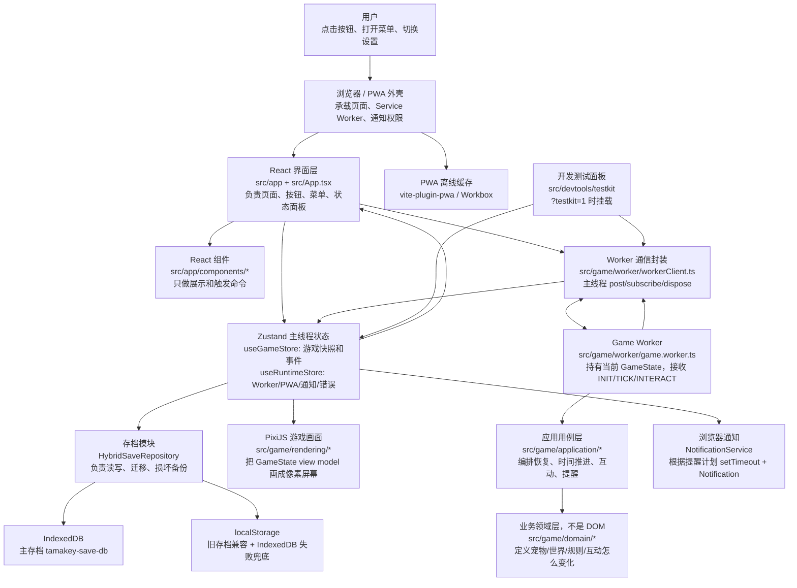
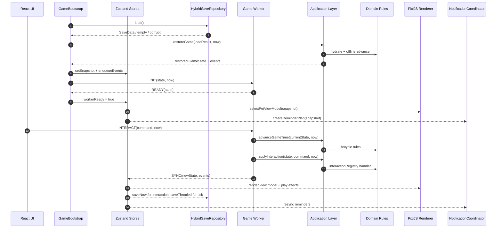
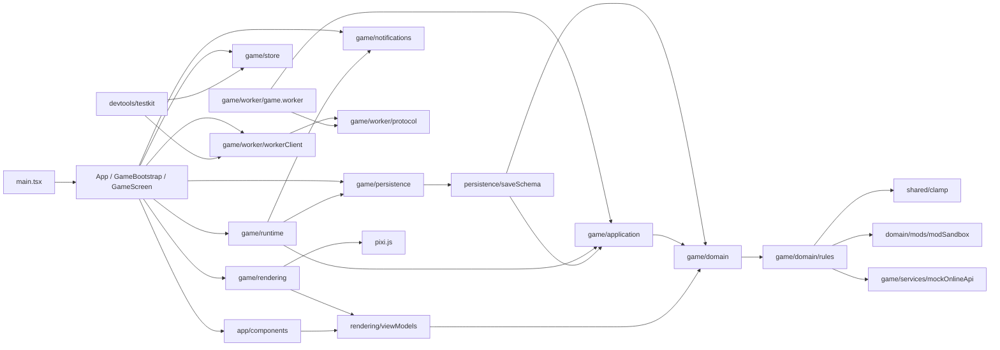
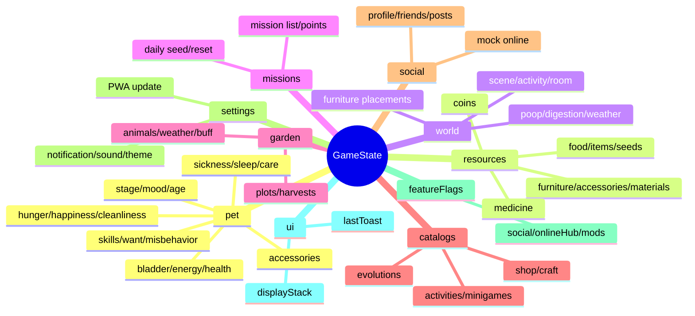
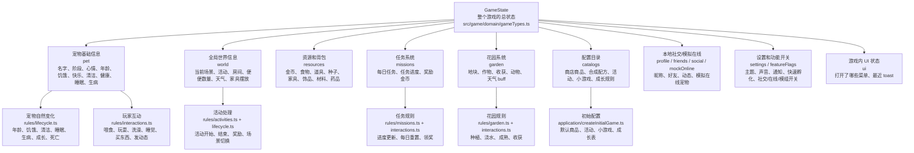
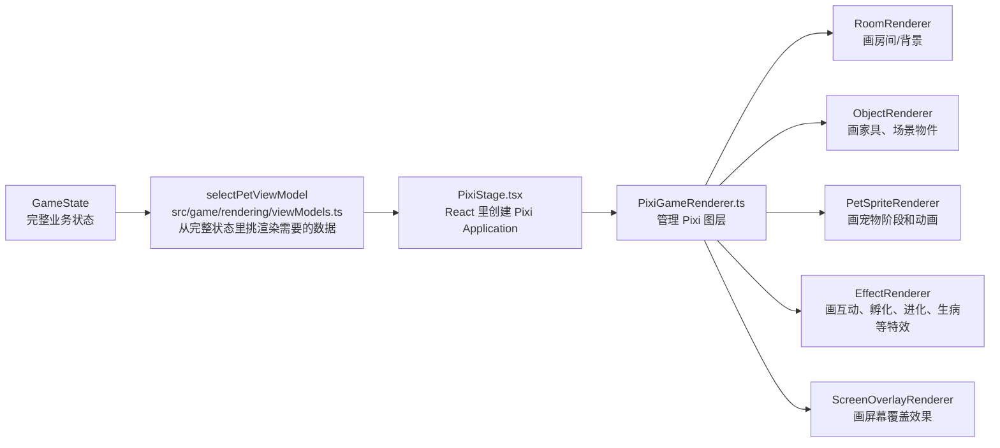
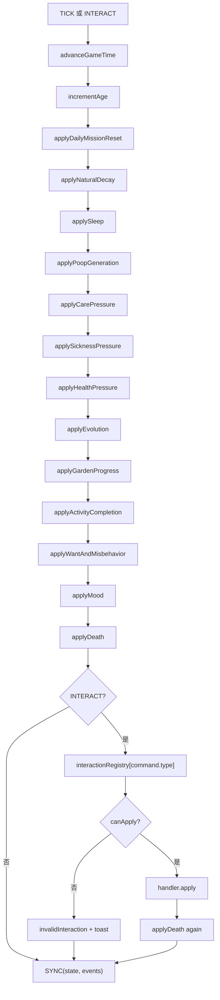
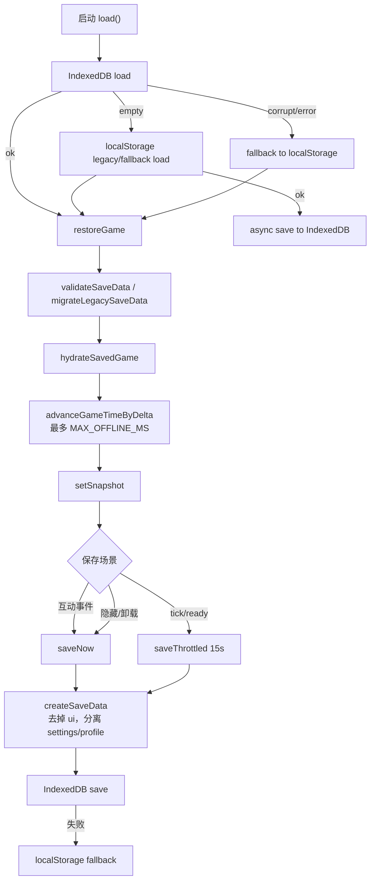
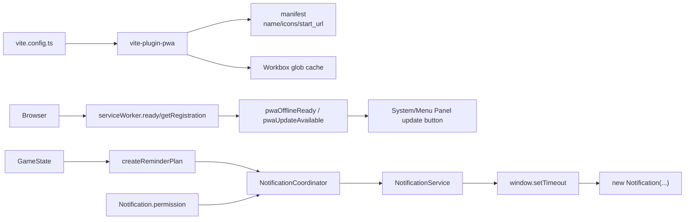

# Tamakey 当前项目架构

本文基于当前仓库代码整理，重点说明模块职责、运行时关系和数据流；不是文件 tree 的重复。

## 1. 项目定位

Tamakey 是一个本地优先的 Web 虚拟宠物游戏：

- 前端应用：Vite + React + TypeScript。
- 游戏状态：Zustand 在主线程保存快照，Web Worker 负责推进和互动计算。
- 画面渲染：PixiJS 渲染像素宠物屏幕，React 渲染控制面板和系统 UI。
- 存档：IndexedDB 优先，localStorage 兜底，支持旧版本存档迁移和导入导出。
- PWA：vite-plugin-pwa 生成 manifest 和 service worker，用于安装和离线缓存。
- 通知：Browser Notification API + 本地 setTimeout 提醒计划。
- 联网/社交：当前是浏览器本地 mock，尚无真实后端。

## 2. 总体架构图

读图方式：从“用户操作”开始看，React 负责界面，Worker 负责游戏计算，Domain 负责纯游戏规则，Zustand 是主线程上的状态快照，PixiJS 只负责把状态画出来。

更直白地说：

- `src/app`：前端页面和按钮在哪里。
- `src/game/worker`：按钮命令怎么送进游戏运行时。
- `src/game/application`：一次操作要按什么顺序处理。
- `src/game/domain`：宠物和游戏世界到底怎么算。
- `src/game/rendering`：怎么算出来的状态怎么画成像素画面。
- `src/game/persistence`：怎么算出来的状态怎么保存。

## 3. 主运行时数据流

## 4. 源码模块职责

| 模块           | 位置                                             | 职责                                                                                                |
| -------------- | ------------------------------------------------ | --------------------------------------------------------------------------------------------------- |
| 应用入口       | `src/main.tsx`, `src/App.tsx`                    | 挂载 React；开发环境带 `?testkit=1` 时懒加载 TestKit。                                              |
| 应用编排       | `src/app/GameBootstrap.tsx`                      | 初始化存档、Worker、Zustand、通知、PWA 更新处理；监听页面隐藏和卸载保存。                           |
| 页面 UI        | `src/app/GameScreen.tsx`, `src/app/components/*` | 将 GameState 转成屏幕快照；渲染动作、菜单、状态、系统面板；把用户操作转成 GameCommand 发给 Worker。 |
| UI 组装规则    | `src/app/gameScreenUi.ts`                        | 生成动作按钮、资源项、状态 meter 的展示模型。                                                       |
| 主线程状态     | `src/game/store/*`                               | `useGameStore` 保存游戏快照和事件队列；`useRuntimeStore` 保存 Worker、通知权限、PWA、错误状态。     |
| Worker 通信    | `src/game/worker/*`                              | 定义请求/响应协议；封装 Worker post/subscribe/dispose；Worker 内持有当前 GameState。                |
| 用例层         | `src/game/application/*`                         | 编排领域规则：创建初始状态、恢复存档、离线推进、tick 推进、互动、提醒计划。                         |
| 领域模型       | `src/game/domain/gameTypes.ts`, `constants.ts`   | 定义 GameState、PetState、资源、任务、社交、活动、事件、命令、存档类型。                            |
| 领域规则       | `src/game/domain/rules/*`                        | 生命周期衰减、睡眠、排泄、生病、成长、死亡、活动完成、花园、任务、互动 handler。                    |
| 本地模组       | `src/game/domain/mods/modSandbox.ts`             | 安全解析本地 JSON 模组，只允许受限商店物品和合成配方。                                              |
| 主线程运行协调 | `src/game/runtime/*`                             | `SaveCoordinator` 节流保存；`NotificationCoordinator` 根据状态同步本地提醒。                        |
| 存档           | `src/game/persistence/*`                         | IndexedDB/localStorage 存取、schema 校验、旧存档迁移、损坏备份、导入导出。                          |
| 渲染           | `src/game/rendering/*`                           | React 创建 Pixi Application；PixiGameRenderer 分层渲染房间、对象、宠物、特效、覆盖层。              |
| 通知           | `src/game/notifications/NotificationService.ts`  | 请求权限、调度本地 timer、展示浏览器通知、取消提醒。                                                |
| Mock 在线服务  | `src/game/services/mockOnlineApi.ts`             | 本地模拟资料、好友、在线宠物、社交动态、快餐下单。未来真实 API 可替换这个边界。                     |
| DevTools       | `src/devtools/testkit/*`                         | 仅开发/测试时挂载，用于切换场景、调状态、跳时间、导入测试状态。                                     |
| 样式和资产     | `src/styles/*`, `public/assets/*`                | 全局样式、主题 token、像素字体和 PWA 图标等静态资源。                                               |
| 测试           | `src/**/*.test.ts`, `tests/e2e/*`                | Vitest 覆盖领域和导入导出；Playwright 覆盖核心用户流、PWA、移动布局和 TestKit 场景。                |

## 5. 模块依赖图

## 6. GameState 的主要内容

`GameState` 是项目的核心真相源，Worker 持有当前值，主线程只拿快照展示和持久化。

## 7. 业务领域模块地图

这一节按“前端开发时想找某类业务代码”来分，不按目录 tree 分。

### 前端常找的代码位置

| 你想找的内容             | 主要看哪里                                                                  | 说明                                                                       |
| ------------------------ | --------------------------------------------------------------------------- | -------------------------------------------------------------------------- |
| 宠物基础信息有哪些       | `src/game/domain/gameTypes.ts` 里的 `PetState`                              | 阶段、心情、年龄、饥饿、快乐、清洁、膀胱、能量、健康、生病、睡眠都在这里。 |
| 整个游戏全局信息有哪些   | `src/game/domain/gameTypes.ts` 里的 `GameState`                             | `pet/resources/world/missions/garden/settings` 这些都挂在总状态下面。      |
| 初始宠物、初始金币和背包 | `src/game/application/createInitialGame.ts`                                 | 新开局默认值、默认商店商品、活动、任务、成长规则都从这里来。               |
| 时间流逝怎么影响宠物     | `src/game/application/advanceGameTime.ts` 和 `src/game/domain/rules/*`      | 每次 tick 会按固定顺序计算饥饿、清洁、生病、成长、死亡等。                 |
| 点击按钮后怎么改状态     | `src/game/application/applyInteraction.ts` 和 `rules/interactions.ts`       | `applyInteraction` 找 handler，具体喂食/洗澡/买东西逻辑在 interactions。   |
| 渲染代码在哪里           | `src/game/rendering/PixiStage.tsx`, `PixiGameRenderer.ts`, 各 Renderer      | Pixi 只消费 view model，不直接改游戏规则。                                 |
| React 页面在哪里         | `src/app/GameScreen.tsx`, `src/app/components/*`, `src/app/gameScreenUi.ts` | UI 负责展示状态，并把操作转成 `GameCommand`。                              |
| UI 用的宠物展示数据      | `src/game/rendering/viewModels.ts`                                          | `selectPetViewModel` 把完整 `GameState` 裁剪成渲染需要的数据。             |
| 存档结构和迁移           | `src/game/persistence/saveSchema.ts`, `HybridSaveRepository.ts`             | 校验、迁移、IndexedDB/localStorage 兜底都在这里。                          |
| 通知提醒                 | `src/game/application/createReminderPlan.ts`, `runtime/Notification*`       | 根据状态生成提醒，再交给浏览器通知服务。                                   |
| 社交和在线模拟           | `src/game/services/mockOnlineApi.ts`, `rules/interactions.ts`               | 目前是本地 mock，不是真后端。                                              |

## 8. 业务到渲染的对应关系

渲染层的关键边界：它只负责“把状态画出来”。例如宠物饿不饿、生不生病、能不能成长，不在 PixiJS 里算；这些都在 `domain/application` 里算完后，再传给渲染层。

## 9. 互动和 tick 的处理逻辑

## 10. 存档与离线推进

## 11. PWA 和通知

注意：`README.md` 写的是 PWA `registerType: 'autoUpdate'`，但当前 `vite.config.ts` 是 `registerType: 'prompt'`，并且 `GameBootstrap` 实现了发现新版后提示并触发 `SKIP_WAITING` 的逻辑。以当前代码为准。

## 12. 当前边界和不确定点

- 当前没有真实后端。好友、社交、在线中心都通过 `mockOnlineApi` 在本地模拟；`docs/⭐️backend-capabilities-todo.md` 已列出后端演进方向。
- 设计文档强调 domain 应保持纯规则层，但当前 `src/game/domain/rules/interactions.ts` 直接依赖了 `src/game/services/mockOnlineApi.ts`。这在现状可工作，但如果后续接真实 API，建议把 mock/real online adapter 上移到 application 或 infrastructure 边界。
- 存档实际已经从早期文档的 localStorage MVP 进化为 IndexedDB 优先、localStorage fallback。
- PWA 更新策略文档和代码存在差异，见上一节。
- 本地模组只解析受限 JSON 配置，不执行用户脚本，也不加载远程资源。

## 13. 阅读代码建议顺序

1. `src/app/GameBootstrap.tsx`：理解启动、Worker、存档、通知、PWA 的总编排。
2. `src/game/domain/gameTypes.ts`：理解核心 GameState 结构。
3. `src/game/worker/game.worker.ts`：理解命令如何进入游戏逻辑。
4. `src/game/application/advanceGameTime.ts` 和 `applyInteraction.ts`：理解 tick 和互动的主流程。
5. `src/game/domain/rules/interactions.ts`、`rules/lifecycle.ts`：理解具体玩法规则。
6. `src/app/GameScreen.tsx` 和 `src/app/components/*`：理解 UI 如何把状态展示出来、如何发命令。
7. `src/game/rendering/PixiStage.tsx`、`PixiGameRenderer.ts`：理解 PixiJS 渲染层。
8. `src/game/persistence/HybridSaveRepository.ts`、`saveSchema.ts`：理解存档、迁移、校验。
