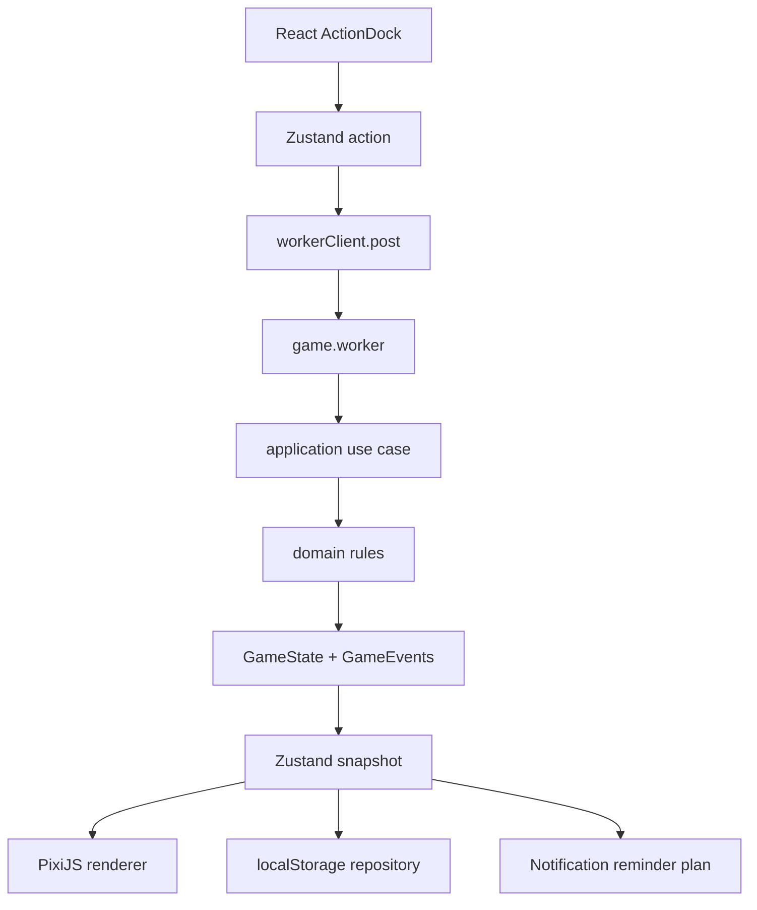

# 02. 架构设计与 SOLID 落地

## 1. 目标架构

Tamakey 的游戏真相只存在于纯 TypeScript domain/application 层。

```txt
React UI
  -> Zustand actions
  -> Game Worker
  -> application use cases
  -> domain rules
  -> GameState + GameEvents
  -> Zustand snapshot
  -> PixiJS view model
  -> localStorage save
  -> Notification plan
```

## 2. 模块边界

```txt
src/app
  应用入口和页面组合。
  React UI 组件按 `09-visual-style-and-assets.md` 实现。

src/game/domain
  纯游戏模型和规则。
  不依赖 React、Zustand、PixiJS、localStorage、Notification。

src/game/application
  用例层。
  编排 domain 规则，处理 restore、interact、advance。

src/game/worker
  独立 runtime。
  接受 INIT/TICK/INTERACT/RESET/SET_NOTIFICATIONS_ENABLED，返回 SYNC/READY/ERROR。

src/game/store
  Zustand 主线程快照。
  不写复杂规则。

src/game/runtime
  主线程 runtime coordinator。
  编排存档、通知、Worker client、store subscriptions 和页面生命周期。

src/game/rendering
  PixiJS 渲染。
  只消费 view model。
  技术边界见 `05-rendering-pixijs.md`，视觉边界见 `09-visual-style-and-assets.md`。

src/game/persistence
  存档读写、校验、迁移。

src/game/notifications
  权限、提醒计划、通知发送。
```

## 3. 目录结构

```txt
src/
  app/
    App.tsx
    GameBootstrap.tsx
    GameScreen.tsx
    components/
      ActionDock.tsx
      StatusIsland.tsx
      StatMeter.tsx
      NotificationControl.tsx
      ResetControl.tsx

  game/
    domain/
      constants.ts
      gameTypes.ts
      petTypes.ts
      rules.ts
      evolution.ts
      interactions.ts
      stats.ts

    application/
      createInitialGame.ts
      advanceGameTime.ts
      applyInteraction.ts
      restoreGame.ts
      createReminderPlan.ts
      summarizeOfflineProgress.ts

    worker/
      game.worker.ts
      protocol.ts
      workerClient.ts

    store/
      useGameStore.ts
      useRuntimeStore.ts
      useUiStore.ts
      selectors.ts

    runtime/
      SaveCoordinator.ts
      NotificationCoordinator.ts

    rendering/
      PixiStage.tsx
      PixiGameRenderer.ts
      PetSpriteRenderer.ts
      RoomRenderer.ts
      ObjectRenderer.ts
      EffectRenderer.ts
      ScreenOverlayRenderer.ts
      AnimationController.ts
      viewModels.ts
      assetManifest.ts

    persistence/
      SaveRepository.ts
      LocalStorageSaveRepository.ts
      saveSchema.ts
      migrations.ts
      saveKeys.ts

    notifications/
      NotificationService.ts
      reminderRules.ts
      notificationCopy.ts

  shared/
    BrowserClock.ts
    Clock.ts
    Result.ts
    clamp.ts

  styles/
    tokens.css
    app.css
```

## 4. SOLID 落地

### 4.1 Single Responsibility

每个模块只做一件事：

- `advanceGameTime`：时间推进。
- `applyInteraction`：互动规则。
- `LocalStorageSaveRepository`：存档。
- `PixiGameRenderer`：渲染。
- `NotificationService`：通知。

反例：

```tsx
function FeedButton() {
  // 不应该在 React 里直接扣 hunger。
}
```

正确方式：

```tsx
workerClient.post({
  type: 'INTERACT',
  interaction: 'feedMeal',
  now: Date.now(),
})
```

### 4.2 Open/Closed

新增玩法不改主流程。

```ts
const interactionHandlers: Record<InteractionType, InteractionHandler> = {
  feedMeal: new FeedMealHandler(),
  feedSnack: new FeedSnackHandler(),
  play: new PlayHandler(),
  clean: new CleanHandler(),
  medicine: new MedicineHandler(),
  sleep: new SleepHandler(),
  wake: new WakeHandler(),
}
```

新增 `brushTeeth` 时只加：

```ts
interactionHandlers.brushTeeth = new BrushTeethHandler()
```

### 4.3 Liskov Substitution

所有 handler 都必须遵守：

```ts
export interface InteractionHandler {
  canApply(state: GameState): boolean
  apply(state: GameState, context: InteractionContext): InteractionResult
}
```

调用方不需要知道具体 handler。

### 4.4 Interface Segregation

Renderer 不需要完整 `GameState`。

```ts
export type PetViewModel = {
  stage: PetStage
  mood: PetMood
  sleepState: SleepState
  sickness: SicknessState
  poopCount: number
  roomId: string
}
```

Notification 不需要知道 PixiJS。

```ts
export type ReminderPlan = {
  reminders: Reminder[]
}
```

### 4.5 Dependency Inversion

application 依赖抽象：

```ts
export interface Clock {
  now(): number
}

export interface SaveRepository {
  load(): LoadSaveResult
  save(data: SaveData): void
}
```

浏览器实现放基础设施层：

```ts
export class BrowserClock implements Clock {
  now() {
    return Date.now()
  }
}
```

### 4.6 禁止事项

这些约束是实现时的硬规则：

- React 组件不得直接修改 `GameState.pet` 数值，只能向 Worker 发送 command。
- PixiJS renderer 不得写业务状态，不得调用 `applyInteraction` 或 `advanceGameTime`。
- Zustand store 不得实现复杂游戏规则，只保存 snapshot、events 和 runtime/UI 状态。
- Worker 不得访问 DOM、React、PixiJS、localStorage、Notification API。
- Renderer 不得读取完整 `GameState`，只能消费 `PetViewModel` 和 `GameEvent`。
- Persistence 不得存 PixiJS 对象、DOM、函数、timer id 或 Worker 实例。
- Notification 不得决定游戏规则，只根据 `ReminderPlan` 调度 best-effort 提醒。

## 5. 数据流



## 6. 最小依赖

```bash
pnpm add zustand pixi.js vite-plugin-pwa
```

可选：

```bash
pnpm add zod
```

## 7. 不做的事情

MVP 阶段不要做：

- 账号系统。
- 云同步。
- 多宠物。
- 商城和复杂经济系统。
- 冒险和地图。
- AI 对话。
- IndexedDB 大存档。

这些都会扩大状态空间，导致第一版调参不可控。
