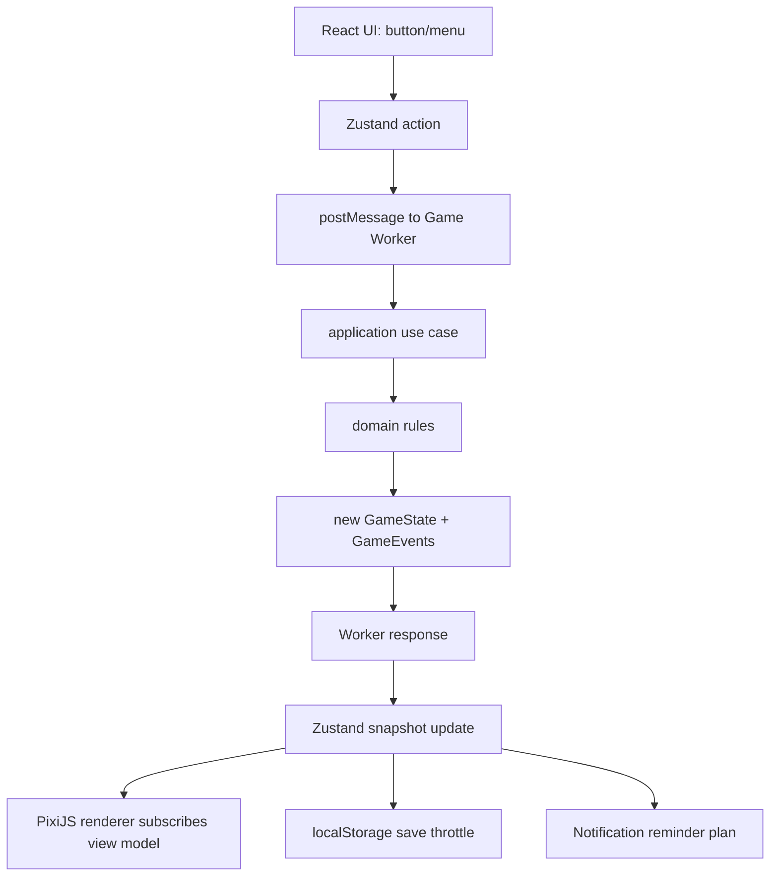

# Tamakey Web Virtual Pet 技术方案

## 1. 背景与目标

Tamakey 是一个 Web 版本的虚拟宠物游戏，体验方向参考经典拓麻歌子，但实现、素材、命名、规则和视觉资产必须原创。

本方案面向当前仓库：

- React 19
- Vite 8
- TypeScript 6
- pnpm
- 目标端：桌面浏览器、移动浏览器、可安装 PWA

计划新增技术栈：

- Zustand：游戏状态与 UI 状态管理
- PixiJS：宠物主画面渲染
- Web Worker：游戏逻辑 tick 与离线推进计算
- localStorage：MVP 本地存档
- vite-plugin-pwa：PWA manifest、service worker、离线缓存
- Notification API：宠物提醒

核心 MVP：

1. 孵化
2. 饥饿
3. 快乐
4. 清洁
5. 排泄物
6. 生病
7. 治疗
8. 睡眠
9. 成长
10. 死亡
11. 存档
12. 离线推进
13. PWA 安装
14. 通知提醒

暂不进入 MVP：

- 账号系统
- 联网同步
- 多宠物
- 复杂商店
- 冒险系统
- 家居装修
- AI 对话
- 原版 Tamagotchi ROM 或原始素材

## 2. 开源项目调研结论

### 2.1 Tamaweb

仓库：https://github.com/autosam/Tamaweb

优势：

- 玩法广度高，覆盖成长、技能、冒险、学校、家居、自定义、任务、PWA。
- 有离线推进与 PWA 缓存思路。
- 它的状态字段和玩法模块能帮助我们判断后续扩展方向。

缺点：

- License 为 CC BY-NC-SA 4.0，商业项目不能直接复用。
- Terms of Use 对名称、品牌、视觉资产、声音有额外限制。
- 原生 JS/Canvas 结构较重，不是 React/Vite 架构。

采纳方式：

- 只参考玩法广度和模块拆分。
- 不复制代码、素材、名称、声音、品牌表达。

### 2.2 tamagotchi-p1-web

仓库：https://github.com/tonypan2/tamagotchi-p1-web

优势：

- React + Vite 方向接近。
- Web Worker 边界清楚：Worker 负责 game loop、状态计算、按钮输入同步、存档。
- UI 与游戏运行时隔离良好。

缺点：

- 是 Tamagotchi P1 模拟器，不是原创游戏。
- 依赖原版 ROM，版权风险高。
- 仓库无 LICENSE，不能默认复用代码。
- 使用 IndexedDB 存 CPU 状态，而本项目 MVP 指定 localStorage。

采纳方式：

- 参考 Worker 与主线程 UI 解耦。
- 不使用 ROM、WASM 模拟器、原版屏幕数据和品牌资产。

### 2.3 jcreighton/tamagotchi

仓库：https://github.com/jcreighton/tamagotchi

优势：

- MIT License。
- HTML5 Canvas 像素动画简单直接。
- sprite sheet、requestAnimationFrame、动画序列写法适合参考。

缺点：

- 玩法很浅。
- 没有系统化存档、离线推进、PWA。
- 不是 React/Vite。

采纳方式：

- 参考像素渲染节奏和 sprite sheet 思路。
- 渲染实现改成 PixiJS。

### 2.4 ChrisChrisLoLo/tamagotchiClone

仓库：https://github.com/ChrisChrisLoLo/tamagotchiClone

优势：

- 玩法覆盖中等：喂食、清洁、活动、工作、商店、存档、医疗、设置。
- 有明确菜单式交互。

缺点：

- Phaser 2 较老。
- 仓库无 LICENSE，不能默认复用。
- 实现以全局变量和状态文件为主，质量一般。
- 没有 PWA 和 Worker。

采纳方式：

- 参考玩法清单和菜单结构。
- 不复用代码。

## 3. 总体架构

### 3.1 架构原则

游戏真相只存在于 domain/application 计算出来的 `GameState`。

React 不负责游戏规则。

PixiJS 不负责游戏规则。

Zustand 不写复杂规则，只保存快照、暴露 action、同步 UI。

Worker 负责耗时或持续性的游戏推进计算。

localStorage 只存可序列化的存档快照，不存 PixiJS 对象、DOM、函数、运行时定时器。

### 3.2 SOLID 对应关系

Single Responsibility Principle：

- `domain`：宠物状态、规则、成长、互动效果。
- `application`：用例编排，例如恢复存档、离线推进、执行互动。
- `worker`：游戏时间推进与消息处理。
- `store`：状态快照与 UI 状态。
- `rendering`：PixiJS 画面。
- `persistence`：存档读写与迁移。
- `notifications`：通知权限、提醒计划、通知发送。

Open/Closed Principle：

- 新增食物、小游戏、成长阶段、疾病类型时，通过配置表或 handler registry 扩展，不改核心 tick 主流程。

Liskov Substitution Principle：

- 所有互动实现统一 `InteractionHandler` 接口。
- 所有存储实现统一 `SaveRepository` 接口。MVP 是 localStorage，未来可替换 IndexedDB 或云存档。

Interface Segregation Principle：

- Renderer 只消费 `PetViewModel`，不依赖完整 `GameState`。
- Notification 只消费 `ReminderPlan`，不关心 PixiJS 和 React。
- Persistence 只处理 `SaveData`，不关心 UI 当前打开哪个菜单。

Dependency Inversion Principle：

- application 层依赖抽象：`Clock`、`SaveRepository`、`NotificationPort`。
- 浏览器 API 封装在 infrastructure 实现中。

### 3.3 运行时数据流



### 3.4 推荐目录结构

```txt
src/
  app/
    App.tsx
    GameBootstrap.tsx
    routes.ts

  game/
    domain/
      constants.ts
      petTypes.ts
      gameTypes.ts
      rules.ts
      evolution.ts
      interactions.ts
      stats.ts
      time.ts

    application/
      advanceGameTime.ts
      applyInteraction.ts
      createInitialGame.ts
      restoreGame.ts
      createReminderPlan.ts
      summarizeOfflineProgress.ts

    worker/
      game.worker.ts
      protocol.ts
      workerClient.ts

    store/
      useGameStore.ts
      useRuntimeStore.ts
      useUiStore.ts
      selectors.ts

    persistence/
      SaveRepository.ts
      LocalStorageSaveRepository.ts
      saveSchema.ts
      migrations.ts
      saveKeys.ts

    rendering/
      PixiStage.tsx
      PixiGameRenderer.ts
      PetSpriteRenderer.ts
      RoomRenderer.ts
      EffectRenderer.ts
      AnimationController.ts
      assetManifest.ts
      viewModels.ts

    notifications/
      NotificationService.ts
      reminderRules.ts
      notificationCopy.ts

  shared/
    Clock.ts
    BrowserClock.ts
    Result.ts
    clamp.ts
    eventBus.ts
```

## 4. 依赖安装与配置

### 4.1 安装依赖

当前仓库有 `pnpm-lock.yaml`，优先使用 pnpm。

```bash
pnpm add zustand pixi.js vite-plugin-pwa
```

可选但建议：

```bash
pnpm add zod
```

如果不引入 zod，MVP 可以手写轻量校验。

### 4.2 Vite PWA 配置伪代码

修改 `vite.config.ts`：

```ts
import path from 'node:path'

import react from '@vitejs/plugin-react'
import { defineConfig } from 'vite'
import { VitePWA } from 'vite-plugin-pwa'

export default defineConfig({
  server: {
    host: '0.0.0.0',
    port: 7777,
  },
  plugins: [
    react(),
    VitePWA({
      registerType: 'autoUpdate',
      includeAssets: ['favicon.ico', 'apple-touch-icon.png'],
      manifest: {
        name: 'Tamakey',
        short_name: 'Tamakey',
        description: 'A web virtual pet game.',
        theme_color: '#d9f99d',
        background_color: '#f8fafc',
        display: 'standalone',
        orientation: 'portrait',
        start_url: '/',
        icons: [
          {
            src: '/pwa-192x192.png',
            sizes: '192x192',
            type: 'image/png',
          },
          {
            src: '/pwa-512x512.png',
            sizes: '512x512',
            type: 'image/png',
          },
        ],
      },
      workbox: {
        globPatterns: ['**/*.{js,css,html,ico,png,svg,webp,json}'],
      },
    }),
  ],
  resolve: {
    alias: {
      '@': path.resolve(__dirname, './src'),
    },
    dedupe: ['react', 'react-dom'],
  },
})
```

## 5. 游戏状态设计

### 5.1 核心类型

```ts
export type PetStage =
  | 'egg'
  | 'baby'
  | 'child'
  | 'teen'
  | 'adult'
  | 'elder'
  | 'dead'

export type PetMood =
  | 'idle'
  | 'happy'
  | 'sad'
  | 'angry'
  | 'sick'
  | 'sleepy'
  | 'sleeping'

export type SicknessState = 'none' | 'mild' | 'severe'

export type SleepState = 'awake' | 'sleeping'

export type StatValue = number

export type PetState = {
  id: string
  name: string
  species: string
  stage: PetStage
  mood: PetMood
  ageSeconds: number
  hunger: StatValue
  happiness: StatValue
  cleanliness: StatValue
  energy: StatValue
  health: StatValue
  sickness: SicknessState
  sleepState: SleepState
  careMistakes: number
  bornAt: number
  lastInteractionAt: number
}

export type InventoryItem = {
  id: string
  quantity: number
}

export type GameState = {
  version: number
  pet: PetState
  resources: {
    coins: number
    food: InventoryItem[]
    medicine: number
  }
  world: {
    poopCount: number
    roomId: string
    digestionSeconds: number
  }
  carePressure: {
    hungrySeconds: number
    dirtySeconds: number
    sickSeconds: number
  }
  settings: {
    notificationsEnabled: boolean
    reducedMotion: boolean
    soundEnabled: boolean
  }
  createdAt: number
  lastTickAt: number
  lastSavedAt: number | null
}

export type GameEvent =
  | { type: 'hatched'; at: number }
  | { type: 'evolved'; from: PetStage; to: PetStage; at: number }
  | { type: 'becameSick'; sickness: SicknessState; at: number }
  | { type: 'recovered'; at: number }
  | { type: 'died'; reason: 'hunger' | 'sickness' | 'neglect'; at: number }
  | { type: 'pooped'; count: number; at: number }
  | { type: 'interactionApplied'; interaction: InteractionType; at: number }
```

### 5.2 数值语义

所有核心数值用 `0-100`：

```txt
hunger:
  0   = 完全不饿
  100 = 极度饥饿

happiness:
  0   = 极不开心
  100 = 非常开心

cleanliness:
  0   = 很脏
  100 = 很干净

energy:
  0   = 没有精力
  100 = 精力充足

health:
  0   = 死亡
  100 = 健康
```

### 5.3 成长阶段

MVP 推荐成长节奏先压缩，方便测试：

```ts
export const EVOLUTION_THRESHOLDS_SECONDS = {
  egg: 3 * 60,
  baby: 30 * 60,
  child: 6 * 60 * 60,
  teen: 24 * 60 * 60,
  adult: 5 * 24 * 60 * 60,
  elder: 12 * 24 * 60 * 60,
} as const
```

开发环境可使用更短阈值：

```ts
export const DEV_EVOLUTION_THRESHOLDS_SECONDS = {
  egg: 10,
  baby: 60,
  child: 180,
  teen: 360,
  adult: 600,
  elder: 900,
} as const
```

### 5.4 初始状态

```ts
export function createInitialGame(now: number): GameState {
  return {
    version: 1,
    pet: {
      id: crypto.randomUUID(),
      name: 'Tamakey',
      species: 'starter',
      stage: 'egg',
      mood: 'idle',
      ageSeconds: 0,
      hunger: 0,
      happiness: 60,
      cleanliness: 100,
      energy: 80,
      health: 100,
      sickness: 'none',
      sleepState: 'awake',
      careMistakes: 0,
      bornAt: now,
      lastInteractionAt: now,
    },
    resources: {
      coins: 0,
      food: [{ id: 'basic-meal', quantity: 5 }],
      medicine: 2,
    },
    world: {
      poopCount: 0,
      roomId: 'default',
      digestionSeconds: 0,
    },
    carePressure: {
      hungrySeconds: 0,
      dirtySeconds: 0,
      sickSeconds: 0,
    },
    settings: {
      notificationsEnabled: false,
      reducedMotion: false,
      soundEnabled: true,
    },
    createdAt: now,
    lastTickAt: now,
    lastSavedAt: null,
  }
}
```

## 6. 玩法设计

### 6.1 MVP 主循环

玩家目标：

- 定时照顾宠物。
- 让宠物从蛋成长到成年。
- 避免长时间饥饿、肮脏、生病和低快乐。

核心循环：

```txt
打开游戏
  -> 查看宠物状态
  -> 根据提示喂食/玩耍/清洁/治疗/睡觉
  -> 宠物状态变化并播放动画
  -> 游戏保存
  -> 离开
  -> 下次回来时进行离线推进
```

### 6.2 互动类型

```ts
export type InteractionType =
  | 'feedMeal'
  | 'feedSnack'
  | 'play'
  | 'clean'
  | 'medicine'
  | 'sleep'
  | 'wake'
```

### 6.3 互动效果建议

孵化采用自动孵化：`egg` 到达年龄阈值后由成长规则触发 `hatched` 事件，不提供用户点击孵化的 `hatch` 互动。

```ts
export const INTERACTION_EFFECTS = {
  feedMeal: {
    hunger: -28,
    happiness: +3,
    energy: -2,
  },
  feedSnack: {
    hunger: -10,
    happiness: +12,
    health: -2,
  },
  play: {
    happiness: +18,
    energy: -12,
    hunger: +8,
  },
  clean: {
    cleanliness: +45,
    happiness: +2,
  },
  medicine: {
    health: +30,
    happiness: -5,
  },
  sleep: {
    energy: +0,
  },
  wake: {
    energy: +0,
  },
} as const
```

### 6.4 互动限制

```txt
egg:
  只能等待孵化，不能喂食、玩耍、清洁、睡觉。

dead:
  只能重开，不能执行任何照顾动作。

sleeping:
  可以 wake。
  不允许 play。
  可允许 medicine，但会降低 happiness。

sickness severe:
  play 无效。
  feed 效果降低。
```

### 6.5 生病规则

生病不应完全随机，要和照顾状态有关。

触发条件：

```txt
cleanliness < 20 持续一段时间
poopCount >= 3 持续一段时间
hunger > 85 持续一段时间
health < 40
```

伪代码：

```ts
function deriveSickness(state: GameState, deltaSeconds: number): SicknessState {
  const pet = state.pet
  let risk = 0

  if (pet.cleanliness < 20) risk += 3
  if (state.world.poopCount >= 3) risk += 3
  if (pet.hunger > 85) risk += 2
  if (pet.health < 40) risk += 2

  const pressure = risk * deltaSeconds

  if (pressure > 60 * 60 * 8) return 'severe'
  if (pressure > 60 * 60 * 3) return 'mild'

  return pet.sickness
}
```

MVP 可以更简单：tick 时用状态阈值判断，不引入概率。

为了让 5 秒 tick 和离线批量推进得到一致结果，生病风险必须累计到状态里，不能只看单次 `deltaSeconds`。

推荐字段：

```ts
type CarePressure = {
  hungrySeconds: number
  dirtySeconds: number
  sickSeconds: number
}
```

### 6.6 死亡规则

死亡应可解释，避免玩家觉得突然。

```txt
health <= 0
  -> dead

hunger >= 100 且持续很久
  -> health 每小时明显下降

severe sickness 且持续很久
  -> health 每小时下降

happiness 不直接导致死亡
  -> 影响成长路线和 mood
```

### 6.7 成长规则

成长取决于年龄和照顾质量。

MVP 先只做阶段变化：

```ts
function deriveNextStage(pet: PetState): PetStage {
  if (pet.stage === 'dead') return 'dead'
  if (pet.ageSeconds < 3 * 60) return 'egg'
  if (pet.ageSeconds < 30 * 60) return 'baby'
  if (pet.ageSeconds < 6 * 60 * 60) return 'child'
  if (pet.ageSeconds < 24 * 60 * 60) return 'teen'
  if (pet.ageSeconds < 5 * 24 * 60 * 60) return 'adult'
  if (pet.ageSeconds < 12 * 24 * 60 * 60) return 'elder'
  return 'elder'
}
```

后续可扩展成路线：

```txt
careScore 高 -> 健康成年体
careScore 中 -> 普通成年体
careScore 低 -> 虚弱成年体
snack 多 -> 圆润路线
play 多 -> 活跃路线
sleep 规律 -> 平衡路线
```

## 7. Tick 与离线推进

### 7.1 Tick 频率

推荐：

```txt
逻辑 tick：5 秒一次
自动保存：10-30 秒节流
PixiJS 渲染：requestAnimationFrame / Pixi ticker
```

不要把游戏逻辑绑在 PixiJS ticker 上，否则后台标签页降频会导致逻辑不稳定。

### 7.2 在线 tick 伪代码

```ts
const LOGIC_TICK_MS = 5_000

setInterval(() => {
  worker.postMessage({
    type: 'TICK',
    now: Date.now(),
  })
}, LOGIC_TICK_MS)
```

Worker 内：

```ts
let currentState: GameState | null = null

self.onmessage = (event) => {
  const message = event.data as GameWorkerRequest

  if (message.type === 'INIT') {
    currentState = message.state
    self.postMessage({ type: 'SYNC', state: currentState, events: [] })
    return
  }

  if (message.type === 'TICK') {
    if (!currentState) return

    const result = advanceGameTime(currentState, message.now)
    currentState = result.state

    self.postMessage({
      type: 'SYNC',
      state: result.state,
      events: result.events,
    })
  }
}
```

### 7.3 离线推进

恢复存档时，使用同一个 `advanceGameTime`，不要写第二套离线规则。

```ts
const MAX_OFFLINE_MS = 24 * 60 * 60 * 1000

function restoreGame(save: SaveData, now: number): RestoreResult {
  const migrated = migrateSave(save)
  const elapsedMs = Math.max(0, now - migrated.gameState.lastTickAt)
  const simulatedMs = Math.min(elapsedMs, MAX_OFFLINE_MS)

  const result = advanceGameTimeByDelta(migrated.gameState, simulatedMs, now)

  return {
    state: {
      ...result.state,
      lastTickAt: now,
    },
    events: result.events,
    offlineSummary: summarizeOfflineProgress(
      migrated.gameState,
      result.state,
      elapsedMs
    ),
  }
}
```

离线摘要示例：

```txt
你离开了 7 小时 20 分钟。
Tamakey 饿了很多，房间变脏了。
它睡了一会儿，现在精力恢复了。
```

### 7.4 批量计算，不循环 N 次

错误方式：

```ts
for (let i = 0; i < offlineMs / LOGIC_TICK_MS; i += 1) {
  state = tick(state)
}
```

正确方式：

```ts
state = applyStatDecay(state, deltaSeconds)
state = applyPoopGeneration(state, deltaSeconds)
state = applySickness(state, deltaSeconds)
state = applyEvolution(state, deltaSeconds)
state = applyDeathCheck(state)
```

## 8. Domain 规则伪代码

### 8.1 advanceGameTime

```ts
export function advanceGameTime(state: GameState, now: number): AdvanceResult {
  if (state.pet.stage === 'dead') {
    return {
      state: {
        ...state,
        lastTickAt: now,
      },
      events: [],
    }
  }

  const deltaMs = Math.max(0, now - state.lastTickAt)
  const deltaSeconds = deltaMs / 1000

  return advanceGameTimeByDelta(state, deltaSeconds, now)
}
```

### 8.2 advanceGameTimeByDelta

```ts
export function advanceGameTimeByDelta(
  state: GameState,
  deltaSeconds: number,
  now: number
): AdvanceResult {
  const events: GameEvent[] = []

  let next = incrementAge(state, deltaSeconds)
  next = applyNaturalDecay(next, deltaSeconds)
  next = applySleep(next, deltaSeconds)
  next = applyPoopGeneration(next, deltaSeconds, events, now)
  next = applyCarePressure(next, deltaSeconds)
  next = applySicknessPressure(next, events, now)
  next = applyHealthPressure(next, deltaSeconds)
  next = applyEvolution(next, events, now)
  next = applyMood(next)
  next = applyDeath(next, events, now)

  return {
    state: {
      ...next,
      lastTickAt: now,
    },
    events,
  }
}
```

### 8.3 natural decay

```ts
function applyNaturalDecay(state: GameState, deltaSeconds: number): GameState {
  const hours = deltaSeconds / 3600
  const pet = state.pet

  const hungerRate = pet.sleepState === 'sleeping' ? 5 : 12
  const happinessRate = pet.sleepState === 'sleeping' ? 2 : 8
  const cleanlinessRate = 6

  return {
    ...state,
    pet: {
      ...pet,
      hunger: clamp(pet.hunger + hungerRate * hours, 0, 100),
      happiness: clamp(pet.happiness - happinessRate * hours, 0, 100),
      cleanliness: clamp(pet.cleanliness - cleanlinessRate * hours, 0, 100),
    },
  }
}
```

### 8.4 sleep

```ts
function applySleep(state: GameState, deltaSeconds: number): GameState {
  const hours = deltaSeconds / 3600
  const pet = state.pet

  if (pet.sleepState === 'sleeping') {
    return {
      ...state,
      pet: {
        ...pet,
        energy: clamp(pet.energy + 25 * hours, 0, 100),
      },
    }
  }

  return {
    ...state,
    pet: {
      ...pet,
      energy: clamp(pet.energy - 6 * hours, 0, 100),
    },
  }
}
```

### 8.5 poop generation

```ts
function applyPoopGeneration(
  state: GameState,
  deltaSeconds: number,
  events: GameEvent[],
  now: number
): GameState {
  const nextDigestionSeconds = state.world.digestionSeconds + deltaSeconds
  const poopIncrease = Math.floor(nextDigestionSeconds / (3 * 3600))
  const remainingDigestionSeconds = nextDigestionSeconds % (3 * 3600)

  if (poopIncrease <= 0) {
    return {
      ...state,
      world: {
        ...state.world,
        digestionSeconds: nextDigestionSeconds,
      },
    }
  }

  const nextCount = clampInteger(state.world.poopCount + poopIncrease, 0, 5)

  if (nextCount > state.world.poopCount) {
    events.push({
      type: 'pooped',
      count: nextCount,
      at: now,
    })
  }

  return {
    ...state,
    world: {
      ...state.world,
      poopCount: nextCount,
      digestionSeconds: remainingDigestionSeconds,
    },
  }
}
```

这样在线每 5 秒 tick 和离线 8 小时批量推进都会产生一致的排泄结果。

### 8.7 care pressure

```ts
function applyCarePressure(state: GameState, deltaSeconds: number): GameState {
  const pet = state.pet

  const hungrySeconds =
    pet.hunger > 85 ? state.carePressure.hungrySeconds + deltaSeconds : 0

  const dirtySeconds =
    pet.cleanliness < 20 || state.world.poopCount >= 3
      ? state.carePressure.dirtySeconds + deltaSeconds
      : 0

  const sickSeconds =
    pet.sickness !== 'none' ? state.carePressure.sickSeconds + deltaSeconds : 0

  return {
    ...state,
    carePressure: {
      hungrySeconds,
      dirtySeconds,
      sickSeconds,
    },
  }
}
```

### 8.8 sickness pressure

```ts
function applySicknessPressure(
  state: GameState,
  events: GameEvent[],
  now: number
): GameState {
  const pet = state.pet

  if (pet.sickness === 'none' && state.carePressure.dirtySeconds > 3 * 3600) {
    events.push({
      type: 'becameSick',
      sickness: 'mild',
      at: now,
    })

    return {
      ...state,
      pet: {
        ...pet,
        sickness: 'mild',
      },
    }
  }

  if (pet.sickness === 'mild' && state.carePressure.sickSeconds > 6 * 3600) {
    events.push({
      type: 'becameSick',
      sickness: 'severe',
      at: now,
    })

    return {
      ...state,
      pet: {
        ...pet,
        sickness: 'severe',
      },
    }
  }

  return state
}
```

### 8.6 mood

```ts
function applyMood(state: GameState): GameState {
  const pet = state.pet

  let mood: PetMood = 'idle'

  if (pet.sleepState === 'sleeping') mood = 'sleeping'
  else if (pet.sickness !== 'none') mood = 'sick'
  else if (pet.energy < 15) mood = 'sleepy'
  else if (pet.hunger > 85) mood = 'angry'
  else if (pet.happiness < 25) mood = 'sad'
  else if (pet.happiness > 75 && pet.hunger < 50) mood = 'happy'

  return {
    ...state,
    pet: {
      ...pet,
      mood,
    },
  }
}
```

## 9. 互动用例

### 9.1 InteractionHandler

```ts
export type InteractionContext = {
  now: number
}

export type InteractionResult = {
  state: GameState
  events: GameEvent[]
}

export interface InteractionHandler {
  canApply(state: GameState): boolean
  apply(state: GameState, context: InteractionContext): InteractionResult
}
```

### 9.2 FeedMealHandler

```ts
export class FeedMealHandler implements InteractionHandler {
  canApply(state: GameState): boolean {
    return (
      state.pet.stage !== 'egg' &&
      state.pet.stage !== 'dead' &&
      state.pet.sleepState === 'awake' &&
      state.pet.hunger > 5
    )
  }

  apply(state: GameState, context: InteractionContext): InteractionResult {
    if (!this.canApply(state)) {
      return { state, events: [] }
    }

    const next: GameState = {
      ...state,
      pet: {
        ...state.pet,
        hunger: clamp(state.pet.hunger - 28, 0, 100),
        happiness: clamp(state.pet.happiness + 3, 0, 100),
        energy: clamp(state.pet.energy - 2, 0, 100),
        lastInteractionAt: context.now,
      },
    }

    return {
      state: applyMood(next),
      events: [
        {
          type: 'interactionApplied',
          interaction: 'feedMeal',
          at: context.now,
        },
      ],
    }
  }
}
```

### 9.3 Registry

```ts
const handlers: Record<InteractionType, InteractionHandler> = {
  feedMeal: new FeedMealHandler(),
  feedSnack: new FeedSnackHandler(),
  play: new PlayHandler(),
  clean: new CleanHandler(),
  medicine: new MedicineHandler(),
  sleep: new SleepHandler(),
  wake: new WakeHandler(),
}

export function applyInteraction(
  state: GameState,
  interaction: InteractionType,
  now: number
): InteractionResult {
  return handlers[interaction].apply(state, { now })
}
```

### 9.4 CleanHandler

```ts
export class CleanHandler implements InteractionHandler {
  canApply(state: GameState): boolean {
    return state.pet.stage !== 'egg' && state.pet.stage !== 'dead'
  }

  apply(state: GameState, context: InteractionContext): InteractionResult {
    if (!this.canApply(state)) {
      return { state, events: [] }
    }

    const next: GameState = {
      ...state,
      pet: {
        ...state.pet,
        cleanliness: clamp(state.pet.cleanliness + 45, 0, 100),
        happiness: clamp(state.pet.happiness + 2, 0, 100),
        lastInteractionAt: context.now,
      },
      world: {
        ...state.world,
        poopCount: 0,
      },
      carePressure: {
        ...state.carePressure,
        dirtySeconds: 0,
      },
    }

    return {
      state: applyMood(next),
      events: [
        {
          type: 'interactionApplied',
          interaction: 'clean',
          at: context.now,
        },
      ],
    }
  }
}
```

### 9.5 MedicineHandler

```ts
export class MedicineHandler implements InteractionHandler {
  canApply(state: GameState): boolean {
    return (
      state.pet.stage !== 'egg' &&
      state.pet.stage !== 'dead' &&
      state.pet.sickness !== 'none' &&
      state.resources.medicine > 0
    )
  }

  apply(state: GameState, context: InteractionContext): InteractionResult {
    if (!this.canApply(state)) {
      return { state, events: [] }
    }

    const nextSickness = state.pet.sickness === 'severe' ? 'mild' : 'none'

    const next: GameState = {
      ...state,
      resources: {
        ...state.resources,
        medicine: state.resources.medicine - 1,
      },
      pet: {
        ...state.pet,
        sickness: nextSickness,
        health: clamp(state.pet.health + 30, 0, 100),
        happiness: clamp(state.pet.happiness - 5, 0, 100),
        lastInteractionAt: context.now,
      },
      carePressure: {
        ...state.carePressure,
        sickSeconds:
          nextSickness === 'none' ? 0 : state.carePressure.sickSeconds,
      },
    }

    return {
      state: applyMood(next),
      events: [
        {
          type: 'interactionApplied',
          interaction: 'medicine',
          at: context.now,
        },
        ...(nextSickness === 'none'
          ? [{ type: 'recovered' as const, at: context.now }]
          : []),
      ],
    }
  }
}
```

## 10. Worker 设计

### 10.1 为什么需要 Worker

MVP 的计算量不大，但 Worker 有三个价值：

1. 主线程只负责 UI 和渲染，游戏逻辑边界清楚。
2. 后续扩展大量任务、小游戏、离线批量计算时不阻塞 UI。
3. 与 tamagotchi-p1-web 类似，保留独立 runtime，方便测试和迁移。

### 10.2 Worker 协议

```ts
export type GameWorkerRequest =
  | { type: 'INIT'; state: GameState; now: number }
  | { type: 'TICK'; now: number }
  | { type: 'INTERACT'; interaction: InteractionType; now: number }
  | { type: 'RESET'; state: GameState; now: number }

export type GameWorkerResponse =
  | { type: 'READY'; state: GameState }
  | { type: 'SYNC'; state: GameState; events: GameEvent[] }
  | { type: 'ERROR'; message: string; recoverable: boolean }
```

### 10.3 workerClient

```ts
export function createGameWorkerClient() {
  const worker = new Worker(new URL('./game.worker.ts', import.meta.url), {
    type: 'module',
  })

  return {
    post(message: GameWorkerRequest) {
      worker.postMessage(message)
    },

    subscribe(onMessage: (message: GameWorkerResponse) => void) {
      const handler = (event: MessageEvent<GameWorkerResponse>) => {
        onMessage(event.data)
      }

      worker.addEventListener('message', handler)

      return () => worker.removeEventListener('message', handler)
    },

    dispose() {
      worker.terminate()
    },
  }
}
```

### 10.4 React bootstrap

```tsx
export function GameBootstrap() {
  const setSnapshot = useGameStore((state) => state.setSnapshot)
  const enqueueEvents = useGameStore((state) => state.enqueueEvents)

  useEffect(() => {
    const now = Date.now()
    const saveRepository = new LocalStorageSaveRepository()
    const restore = restoreGame(saveRepository.load(), now)

    const client = createGameWorkerClient()

    const unsubscribe = client.subscribe((message) => {
      if (message.type === 'SYNC' || message.type === 'READY') {
        setSnapshot(message.state)
      }

      if (message.type === 'SYNC') {
        enqueueEvents(message.events)
      }
    })

    client.post({
      type: 'INIT',
      state: restore.state,
      now,
    })

    const tickTimer = window.setInterval(() => {
      client.post({ type: 'TICK', now: Date.now() })
    }, 5_000)

    return () => {
      window.clearInterval(tickTimer)
      unsubscribe()
      client.dispose()
    }
  }, [enqueueEvents, setSnapshot])

  return <GameScreen />
}
```

## 11. Zustand Store 设计

### 11.1 拆分原则

```txt
useGameStore:
  存游戏快照、事件队列、游戏 action。

useRuntimeStore:
  存 Worker 是否 ready、窗口是否 focus、通知权限、性能档位。

useUiStore:
  存当前菜单、弹窗、选中操作、离线摘要是否展示。
```

### 11.2 useGameStore 伪代码

```ts
import { subscribeWithSelector } from 'zustand/middleware'

type GameStore = {
  snapshot: GameState | null
  events: GameEvent[]
  setSnapshot: (snapshot: GameState) => void
  enqueueEvents: (events: GameEvent[]) => void
  clearEvents: () => void
}

export const useGameStore = create<GameStore>()(
  subscribeWithSelector((set) => ({
    snapshot: null,
    events: [],

    setSnapshot: (snapshot) => {
      set({ snapshot })
    },

    enqueueEvents: (events) => {
      if (events.length === 0) return
      set((state) => ({
        events: [...state.events, ...events],
      }))
    },

    clearEvents: () => {
      set({ events: [] })
    },
  }))
)
```

### 11.3 selectors

```ts
export function selectPetViewModel(state: GameState): PetViewModel {
  return {
    stage: state.pet.stage,
    mood: state.pet.mood,
    sleepState: state.pet.sleepState,
    sickness: state.pet.sickness,
    poopCount: state.world.poopCount,
    roomId: state.world.roomId,
  }
}

export function selectNeeds(state: GameState) {
  return {
    hunger: state.pet.hunger,
    happiness: state.pet.happiness,
    cleanliness: state.pet.cleanliness,
    energy: state.pet.energy,
    health: state.pet.health,
  }
}
```

## 12. 存档设计

### 12.1 存档结构

```ts
export type SaveData = {
  schemaVersion: 1
  savedAt: number
  gameState: GameState
}
```

localStorage key：

```ts
export const SAVE_KEY = 'tamakey.save.v1'
export const SAVE_BACKUP_KEY = 'tamakey.save.backup.v1'
```

### 12.2 SaveRepository

```ts
export interface SaveRepository {
  load(): SaveData | null
  save(data: SaveData): void
  backupCorruptSave(raw: string): void
  clear(): void
}
```

### 12.3 LocalStorageSaveRepository

```ts
export class LocalStorageSaveRepository implements SaveRepository {
  load(): SaveData | null {
    const raw = localStorage.getItem(SAVE_KEY)
    if (!raw) return null

    try {
      const parsed = JSON.parse(raw)
      return validateSaveData(parsed)
    } catch {
      this.backupCorruptSave(raw)
      return null
    }
  }

  save(data: SaveData): void {
    localStorage.setItem(SAVE_KEY, JSON.stringify(data))
  }

  backupCorruptSave(raw: string): void {
    localStorage.setItem(SAVE_BACKUP_KEY, raw)
  }

  clear(): void {
    localStorage.removeItem(SAVE_KEY)
  }
}
```

### 12.4 保存时机

```txt
互动成功后立即保存
tick 后最多 10-30 秒保存一次
visibilitychange -> hidden 时保存
beforeunload 时保存
```

伪代码：

```ts
const saveThrottled = throttle((state: GameState) => {
  repository.save({
    schemaVersion: 1,
    savedAt: Date.now(),
    gameState: {
      ...state,
      lastSavedAt: Date.now(),
    },
  })
}, 15_000)

useGameStore.subscribe(
  (state) => state.snapshot,
  (snapshot) => {
    if (!snapshot) return
    saveThrottled(snapshot)
  }
)

document.addEventListener('visibilitychange', () => {
  if (document.visibilityState !== 'hidden') return
  const snapshot = useGameStore.getState().snapshot
  if (!snapshot) return
  saveImmediately(snapshot)
})
```

### 12.5 为什么 MVP 用 localStorage 但保留 Repository

localStorage 优点：

- 简单。
- 易调试。
- 适合 MVP。

localStorage 局限：

- 容量小。
- 同步 API。
- 不适合大量图片、音频、大型事件日志。

通过 `SaveRepository` 抽象，后续可以无痛迁移到 IndexedDB：

```txt
LocalStorageSaveRepository -> IndexedDbSaveRepository -> CloudSaveRepository
```

## 13. PixiJS 渲染设计

### 13.1 渲染目标

做“低分辨率像素屏”，而不是普通高清卡通页。

建议逻辑分辨率：

```txt
160 x 144
```

也可以使用：

```txt
192 x 160
240 x 160
```

MVP 推荐 `160 x 144`，方便做像素资产。

CSS 放大：

```css
.pet-screen canvas {
  width: min(90vw, 480px);
  aspect-ratio: 160 / 144;
  image-rendering: pixelated;
}
```

PixiJS 初始化：

```ts
const app = new Application()

await app.init({
  width: 160,
  height: 144,
  background: '#d8e7b5',
  antialias: false,
  resolution: 1,
  autoDensity: false,
})
```

### 13.2 层级

```txt
Stage
  RoomLayer
    background
    floor
  ObjectLayer
    food
    poop
    toy
  PetLayer
    shadow
    pet sprite
    face/emotion overlay
  EffectLayer
    hearts
    sweat
    sleep bubbles
    sick mark
  ScreenOverlayLayer
    LCD grid
    vignette
```

### 13.3 assetManifest

```ts
export const assetManifest = {
  room: {
    default: '/assets/rooms/default-room.png',
  },
  pet: {
    egg: '/assets/pets/egg.png',
    baby: '/assets/pets/baby.png',
    child: '/assets/pets/child.png',
    teen: '/assets/pets/teen.png',
    adult: '/assets/pets/adult.png',
    elder: '/assets/pets/elder.png',
    dead: '/assets/pets/dead.png',
  },
  effects: {
    heart: '/assets/effects/heart.png',
    sick: '/assets/effects/sick.png',
    sleep: '/assets/effects/sleep.png',
    poop: '/assets/objects/poop.png',
  },
} as const
```

### 13.4 PetViewModel

Renderer 不直接接收完整 `GameState`。

```ts
export type PetViewModel = {
  stage: PetStage
  mood: PetMood
  sleepState: SleepState
  sickness: SicknessState
  poopCount: number
  roomId: string
}
```

### 13.5 PixiGameRenderer

```ts
export class PixiGameRenderer {
  private app: Application
  private petRenderer: PetSpriteRenderer
  private roomRenderer: RoomRenderer
  private effectRenderer: EffectRenderer
  private currentViewModel: PetViewModel | null = null

  constructor(app: Application) {
    this.app = app
    this.roomRenderer = new RoomRenderer()
    this.petRenderer = new PetSpriteRenderer()
    this.effectRenderer = new EffectRenderer()

    this.app.stage.addChild(this.roomRenderer.container)
    this.app.stage.addChild(this.petRenderer.container)
    this.app.stage.addChild(this.effectRenderer.container)

    this.app.ticker.add((ticker) => {
      this.update(ticker.deltaMS)
    })
  }

  setViewModel(viewModel: PetViewModel) {
    const previous = this.currentViewModel
    this.currentViewModel = viewModel

    this.roomRenderer.setRoom(viewModel.roomId)
    this.petRenderer.setPetState(viewModel)

    if (previous?.mood !== viewModel.mood) {
      this.effectRenderer.playMoodTransition(viewModel.mood)
    }
  }

  update(deltaMs: number) {
    this.petRenderer.update(deltaMs)
    this.effectRenderer.update(deltaMs)
  }

  destroy() {
    this.app.destroy(true)
  }
}
```

### 13.6 PixiStage React 组件

```tsx
export function PixiStage() {
  const hostRef = useRef<HTMLDivElement | null>(null)
  const rendererRef = useRef<PixiGameRenderer | null>(null)
  const snapshot = useGameStore((state) => state.snapshot)

  useEffect(() => {
    if (!hostRef.current) return

    let disposed = false
    let app: Application | null = null

    async function start() {
      app = new Application()

      await app.init({
        width: 160,
        height: 144,
        background: '#d8e7b5',
        antialias: false,
        resolution: 1,
      })

      if (disposed || !hostRef.current) {
        app.destroy(true)
        return
      }

      hostRef.current.appendChild(app.canvas)
      rendererRef.current = new PixiGameRenderer(app)
    }

    start()

    return () => {
      disposed = true
      rendererRef.current?.destroy()
      rendererRef.current = null
      app = null
    }
  }, [])

  useEffect(() => {
    if (!snapshot || !rendererRef.current) return
    rendererRef.current.setViewModel(selectPetViewModel(snapshot))
  }, [snapshot])

  return <div className='pet-screen' ref={hostRef} />
}
```

### 13.7 动画状态机

```ts
type AnimationName =
  | 'egg_idle'
  | 'egg_hatch'
  | 'baby_idle'
  | 'baby_happy'
  | 'baby_sad'
  | 'pet_eat'
  | 'pet_play'
  | 'pet_sleep'
  | 'pet_sick'
  | 'pet_dead'

function chooseAnimation(viewModel: PetViewModel): AnimationName {
  if (viewModel.stage === 'dead') return 'pet_dead'
  if (viewModel.stage === 'egg') return 'egg_idle'
  if (viewModel.sleepState === 'sleeping') return 'pet_sleep'
  if (viewModel.sickness !== 'none') return 'pet_sick'
  if (viewModel.mood === 'happy') return 'baby_happy'
  if (viewModel.mood === 'sad') return 'baby_sad'
  return 'baby_idle'
}
```

## 14. React UI 设计

### 14.1 页面结构

```tsx
export function GameScreen() {
  return (
    <main className='game-shell'>
      <section className='device'>
        <StatusBar />
        <PixiStage />
        <ActionDock />
      </section>
      <GameMenu />
      <OfflineSummaryDialog />
      <NotificationPermissionDialog />
    </main>
  )
}
```

### 14.2 操作按钮

MVP 操作：

```txt
喂饭
零食
玩耍
清洁
治疗
睡觉/叫醒
状态
重开
```

按钮只发 action，不直接改状态：

```tsx
function ActionDock() {
  const workerClient = useRuntimeStore((state) => state.workerClient)
  const snapshot = useGameStore((state) => state.snapshot)

  function interact(interaction: InteractionType) {
    if (!workerClient || !snapshot) return

    workerClient.post({
      type: 'INTERACT',
      interaction,
      now: Date.now(),
    })
  }

  return (
    <nav className='action-dock'>
      <button onClick={() => interact('feedMeal')}>喂饭</button>
      <button onClick={() => interact('feedSnack')}>零食</button>
      <button onClick={() => interact('play')}>玩耍</button>
      <button onClick={() => interact('clean')}>清洁</button>
      <button onClick={() => interact('medicine')}>治疗</button>
      <button
        onClick={() =>
          interact(snapshot?.pet.sleepState === 'sleeping' ? 'wake' : 'sleep')
        }
      >
        睡觉
      </button>
    </nav>
  )
}
```

后续实际 UI 应使用图标按钮和 tooltip，避免文字按钮过多挤压移动端空间。

## 15. PWA 与 Notification

### 15.1 能力边界

Notification API 要求：

- HTTPS 或 localhost。
- 用户授权。
- 权限请求应由用户手势触发。

浏览器端 PWA 不能保证精确闹钟式后台通知。MVP 可以做到：

- 应用打开时，前台定时提醒。
- PWA service worker 可展示通知。
- 用户点击通知回到游戏。

如果要“哪怕浏览器彻底关闭也准时提醒”，后续需要 Web Push + 后端。

### 15.2 ReminderPlan

```ts
export type ReminderPlan = {
  reminders: Reminder[]
}

export type Reminder = {
  id: string
  at: number
  title: string
  body: string
  reason: 'hungry' | 'dirty' | 'sick' | 'lonely' | 'energyFull'
}
```

### 15.3 生成提醒计划

```ts
export function createReminderPlan(
  state: GameState,
  now: number
): ReminderPlan {
  const reminders: Reminder[] = []

  if (state.pet.hunger > 70) {
    reminders.push({
      id: 'hungry-now',
      at: now + 5 * 60 * 1000,
      title: 'Tamakey 饿了',
      body: '回来喂点东西吧。',
      reason: 'hungry',
    })
  } else {
    reminders.push({
      id: 'hungry-later',
      at: estimateTimeUntilHunger(state, 75, now),
      title: 'Tamakey 可能饿了',
      body: '看一眼它的状态。',
      reason: 'hungry',
    })
  }

  if (state.world.poopCount >= 2 || state.pet.cleanliness < 30) {
    reminders.push({
      id: 'dirty',
      at: now + 10 * 60 * 1000,
      title: '房间需要清洁',
      body: '太脏会让 Tamakey 生病。',
      reason: 'dirty',
    })
  }

  return { reminders }
}
```

### 15.4 NotificationService

```ts
export class NotificationService {
  async requestPermission(): Promise<NotificationPermission> {
    if (!('Notification' in window)) return 'denied'
    return Notification.requestPermission()
  }

  show(reminder: Reminder): void {
    if (!('Notification' in window)) return
    if (Notification.permission !== 'granted') return

    new Notification(reminder.title, {
      body: reminder.body,
      tag: reminder.id,
    })
  }

  schedule(plan: ReminderPlan): void {
    for (const reminder of plan.reminders) {
      const delay = Math.max(0, reminder.at - Date.now())

      window.setTimeout(() => {
        this.show(reminder)
      }, delay)
    }
  }
}
```

MVP 注意：

- 需要维护 timer id，状态变化时取消旧 timer。
- 不要在首次打开页面就弹权限请求。
- 建议在用户完成 2-3 次互动后展示“开启提醒”入口。

## 16. UI 与渲染体验规范

### 16.1 设备感

首屏应该是可玩的设备，不是营销落地页。

布局建议：

```txt
上方：状态图标条
中间：像素屏幕
下方：操作按钮
右侧或底部：菜单区
```

移动端：

```txt
屏幕固定比例
操作按钮 2 行或环形布局
状态条使用图标 + 小进度条
```

桌面端：

```txt
设备居中
右侧可以展示状态详情和事件日志
```

### 16.2 状态反馈

每个互动都需要：

```txt
状态数值变化
宠物动画
短反馈效果
必要时事件提示
保存状态
```

示例：

```txt
喂饭：
  宠物走向食物
  食物 sprite 出现
  咀嚼动画
  hunger 降低
  happiness 略升

清洁：
  排泄物消失
  泡泡效果
  cleanliness 提高

治疗：
  药箱/十字图标出现
  sickness 从 severe -> mild -> none
```

## 17. 测试方案

### 17.1 Domain 单元测试

必须测：

```txt
advanceGameTime 会随时间增加 hunger
睡觉时 energy 恢复
低 cleanliness 会导致 sickness
health <= 0 会进入 dead
dead 后 tick 不再改变核心状态
达到年龄阈值会成长
clean 会清空 poopCount
feed 不允许作用于 egg/dead
```

示例伪代码：

```ts
it('increases hunger after one hour', () => {
  const state = createTestGameState({
    hunger: 10,
    lastTickAt: 0,
  })

  const result = advanceGameTime(state, 60 * 60 * 1000)

  expect(result.state.pet.hunger).toBeGreaterThan(10)
})
```

### 17.2 Worker 测试

必须测：

```txt
INIT 返回 READY 或 SYNC
TICK 返回新状态
INTERACT 返回 interactionApplied event
无状态时 TICK 不崩溃
```

### 17.3 存档测试

必须测：

```txt
无存档时创建新游戏
合法存档可恢复
坏 JSON 会备份并创建新游戏
schemaVersion 迁移成功
离线推进使用 lastTickAt
```

### 17.4 渲染 smoke test

必须测：

```txt
PixiStage 能挂载 canvas
snapshot 更新后 renderer.setViewModel 被调用
stage/mood 改变后动画名改变
组件卸载时 Pixi app destroy
```

### 17.5 E2E 测试

建议用 Playwright：

```txt
打开首页
看到宠物屏幕
点击喂饭
hunger 数值下降
刷新页面
状态仍存在
模拟 localStorage lastTickAt 为过去
刷新后触发离线摘要
```

## 18. 实施里程碑

### 18.1 Milestone 1：核心规则可运行

产出：

- `GameState`
- `createInitialGame`
- `advanceGameTime`
- `applyInteraction`
- 基础单元测试

验收：

- 不接 UI 也能用测试跑通孵化、饥饿、清洁、生病、死亡、成长。

### 18.2 Milestone 2：React + Zustand + Worker 跑通

产出：

- `game.worker.ts`
- `workerClient.ts`
- `useGameStore`
- `GameBootstrap`

验收：

- 页面打开后能自动 tick。
- 点击按钮能修改状态。
- React 组件不包含游戏规则。

### 18.3 Milestone 3：localStorage 存档与离线推进

产出：

- `LocalStorageSaveRepository`
- `restoreGame`
- `migrations`
- `OfflineSummaryDialog`

验收：

- 刷新页面状态保留。
- 手动修改 `lastTickAt` 后刷新，会产生离线推进。
- 坏档不会白屏。

### 18.4 Milestone 4：PixiJS 像素屏

产出：

- `PixiStage`
- `PixiGameRenderer`
- `PetSpriteRenderer`
- 占位像素资产

验收：

- 页面中出现 Pixi canvas。
- 宠物根据 mood/stage 切换动画。
- 操作后有明确视觉反馈。

### 18.5 Milestone 5：PWA 与通知

产出：

- Vite PWA 配置
- manifest icons
- `NotificationService`
- `createReminderPlan`

验收：

- Chrome DevTools Application 能看到 manifest 和 service worker。
- 本地 preview 能安装 PWA。
- 用户授权后能收到前台通知。

## 19. 风险与决策

### 19.1 IP 风险

不能使用：

- Tamagotchi 名称作为产品名。
- Bandai 原始角色。
- 原版 ROM。
- 原版图标和设备外观。
- 其他开源项目未授权素材。

可以使用：

- 虚拟宠物这个通用玩法概念。
- 原创角色和原创设备 UI。
- MIT 项目的代码片段，但仍建议只参考思路。

### 19.2 localStorage 风险

MVP 可用，但后续如果出现这些需求，应迁移 IndexedDB：

- 多存档位。
- 大量事件日志。
- 自定义房间/贴纸/截图。
- 云同步前的本地队列。

### 19.3 Notification 风险

浏览器不保证精确后台提醒。

MVP 文案不要承诺“准时叫你回来”，应该表达为：

```txt
开启提醒后，我们会尽量在 Tamakey 需要照顾时提醒你。
```

### 19.4 Worker 复杂度

MVP 可以不用 Worker 也能跑，但本项目建议从一开始加 Worker，因为它能强制隔离游戏逻辑和 UI。

需要注意：

- Worker 不能访问 DOM。
- Worker 不能访问 localStorage。
- Worker 消息必须可序列化。
- 不要把 class 实例通过 postMessage 传来传去，传 plain object。

## 20. 最小可运行实现清单

要让项目完整跑起来，最少需要实现这些文件：

```txt
src/game/domain/gameTypes.ts
src/game/domain/constants.ts
src/game/domain/rules.ts
src/game/application/createInitialGame.ts
src/game/application/advanceGameTime.ts
src/game/application/applyInteraction.ts
src/game/application/restoreGame.ts
src/game/worker/protocol.ts
src/game/worker/game.worker.ts
src/game/worker/workerClient.ts
src/game/store/useGameStore.ts
src/game/store/useRuntimeStore.ts
src/game/store/selectors.ts
src/game/persistence/SaveRepository.ts
src/game/persistence/LocalStorageSaveRepository.ts
src/game/rendering/PixiStage.tsx
src/game/rendering/PixiGameRenderer.ts
src/game/rendering/PetSpriteRenderer.ts
src/game/rendering/viewModels.ts
src/game/notifications/NotificationService.ts
src/app/GameBootstrap.tsx
src/app/GameScreen.tsx
```

最小页面入口：

```tsx
import { GameBootstrap } from './app/GameBootstrap'

export function App() {
  return <GameBootstrap />
}
```

运行命令：

```bash
pnpm install
pnpm add zustand pixi.js vite-plugin-pwa
pnpm dev
```

构建检查：

```bash
pnpm typecheck
pnpm lint
pnpm build
```

## 21. 推荐后续扩展路线

MVP 稳定后，按这个顺序扩：

1. 简单商店：食物、药品、玩具。
2. 货币：玩小游戏或工作获得 coins。
3. 成长路线：根据 careScore 进化成不同形态。
4. 小游戏：1 个 15 秒以内的反应小游戏。
5. 房间装饰：只影响视觉，不先影响复杂数值。
6. 多存档：迁移 IndexedDB。
7. 云同步：登录后再加，不要 MVP 一开始加。

## 22. 方案 Review

### 22.1 已明确的细节

- 技术栈和当前项目匹配：React + Vite + TypeScript。
- 依赖安装命令明确。
- 目录结构明确。
- `GameState`、`PetState`、`GameEvent` 类型明确。
- 互动类型和效果明确。
- tick 和离线推进算法明确。
- Worker 协议明确。
- Zustand 分层明确。
- localStorage 存档结构、key、保存时机明确。
- PixiJS 初始化、分辨率、层级、view model、动画选择明确。
- PWA 与 Notification 的能力边界明确。
- MVP 里程碑和验收标准明确。
- 测试范围明确。

### 22.2 仍需产品侧确认的细节

这些不是技术阻塞，但会影响体验和资产制作：

1. 宠物视觉风格：黑白 LCD、双色像素、彩色像素、现代卡通像素。
2. 宠物名称和世界观：不能使用 Tamagotchi 品牌表达。
3. 成长时间：真实慢养成，还是适合 Web 高频试玩的短周期。
4. 死亡惩罚：永久死亡、可复活、还是重开。
5. 通知语气：可爱、克制、拟人化、还是工具式提醒。

### 22.3 技术判断

这份方案可以直接进入实现。

唯一需要严格控制的是 scope：MVP 不要同时做商店、冒险、家居、多宠物和联网。虚拟宠物项目的复杂度主要来自时间系统、状态规则和持续反馈，如果第一版玩法太宽，状态调参会失控。

建议第一轮只做到：

```txt
一只宠物
五个核心属性
六个照顾入口
四个 MVP 成长阶段
一个像素房间
localStorage 单存档
PWA 安装
基础通知
```

这一版跑顺后，再扩充玩法广度。
